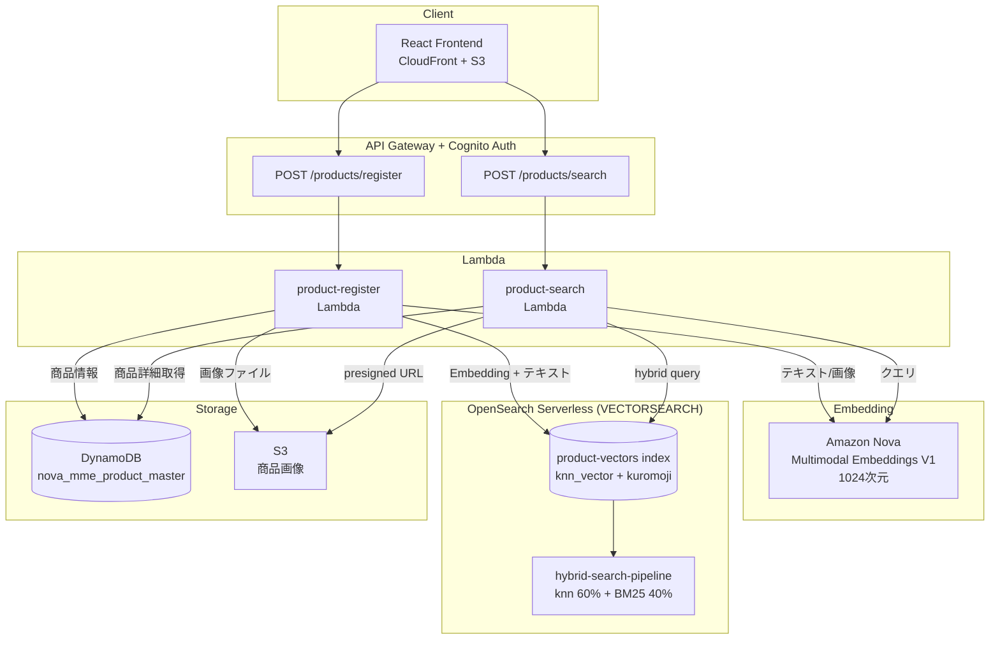

# 構成B: OpenSearch Serverless (Hybrid Search)

## アーキテクチャ概要



```
[クエリ] → Nova Embeddings → OpenSearch Serverless (knn + BM25 hybrid) → DynamoDB (商品詳細) → レスポンス
```

- **ベクトル + 全文検索**: Amazon OpenSearch Serverless (VECTORSEARCH Collection)
- **メタデータストア**: Amazon DynamoDB（構成Aと共有）
- **Embedding モデル**: Amazon Nova Multimodal Embeddings V1 (1024次元)
- **冗長化**: StandbyReplicas DISABLED（コスト最適化、最低1 OCU）

## データモデル

### OpenSearch インデックス: `product-vectors`

| フィールド | 型 | Analyzer | 説明 |
|---|---|---|---|
| `embedding` | knn_vector (1024) | - | Nova Embeddingsベクトル |
| `product_id` | keyword | - | 商品ID（DynamoDB PK） |
| `product_code` | keyword | - | 商品コード |
| `product_name` | text | ja_analyzer (kuromoji) | 商品名（全文検索対象） |
| `category` | keyword | - | カテゴリ（フィルタ用） |
| `text_content` | text | ja_analyzer (kuromoji) | 商品説明全文（全文検索対象） |
| `embedding_type` | keyword | - | "image" or "text" |

**knn設定:**
```json
{
  "type": "knn_vector",
  "dimension": 1024,
  "method": {
    "engine": "faiss",
    "name": "hnsw",
    "space_type": "cosinesimil"
  }
}
```

**日本語Analyzer:**
```json
{
  "analyzer": {
    "ja_analyzer": {
      "type": "custom",
      "tokenizer": "kuromoji_tokenizer",
      "filter": ["kuromoji_baseform", "kuromoji_part_of_speech", "lowercase"]
    }
  }
}
```

- `kuromoji_tokenizer`: 辞書ベースの形態素解析で日本語を正確にトークン分割
- `kuromoji_baseform`: 活用形を基本形に変換（「走った」→「走る」）
- `kuromoji_part_of_speech`: 助詞・助動詞等のストップワード相当を除去

### ドキュメント構造

1商品につき最大2ドキュメント（画像Embedding用 + テキストEmbedding用）:

```json
// 画像Embeddingドキュメント
{
  "product_id": "uuid-xxx",
  "product_code": "A00001",
  "product_name": "やわらかボストンバッグ",
  "category": "バッグ",
  "text_content": "◆キャッチコピー...",
  "embedding": [0.012, -0.034, ...],  // 画像から生成
  "embedding_type": "image"
}

// テキストEmbeddingドキュメント
{
  "product_id": "uuid-xxx",
  "product_code": "A00001",
  "product_name": "やわらかボストンバッグ",
  "category": "バッグ",
  "text_content": "◆キャッチコピー...",
  "embedding": [0.045, 0.021, ...],  // テキストから生成
  "embedding_type": "text"
}
```

**注意**: OpenSearch Serverless はドキュメントID指定での `index` 操作をサポートしていない。自動生成IDが使用される。

## Search Pipeline

### `hybrid-search-pipeline`

```json
{
  "description": "Hybrid search normalization pipeline",
  "phase_results_processors": [
    {
      "normalization-processor": {
        "normalization": { "technique": "min_max" },
        "combination": {
          "technique": "arithmetic_mean",
          "parameters": { "weights": [0.6, 0.4] }
        }
      }
    }
  ]
}
```

- **正規化**: min_max（各サブクエリのスコアを0-1に正規化）
- **合成**: 加重平均（knn: 60%, BM25: 40%）

## 検索クエリ設計

### テキストクエリ時: ハイブリッド検索

```json
{
  "size": 10,
  "query": {
    "hybrid": {
      "queries": [
        {
          "knn": {
            "embedding": { "vector": [0.012, ...], "k": 10 }
          }
        },
        {
          "bool": {
            "should": [
              { "match": { "text_content": { "query": "ボストンバッグ", "boost": 1.0 } } },
              { "match": { "product_name": { "query": "ボストンバッグ", "boost": 2.0 } } }
            ]
          }
        }
      ]
    }
  },
  "search_pipeline": "hybrid-search-pipeline"
}
```

- **knn**: クエリベクトルとの cosine 類似度
- **BM25**: `text_content`（boost 1.0）+ `product_name`（boost 2.0）で全文検索
- `product_name` に高いboostを設定し、商品名の部分一致を優先

### 画像クエリ時: knnのみ

```json
{
  "size": 10,
  "query": {
    "knn": {
      "embedding": { "vector": [0.012, ...], "k": 10 }
    }
  }
}
```

画像クエリではテキスト全文検索の意味がないため、knnのみ実行。

### スコア変換

```python
# ハイブリッド検索のスコア（0-1、正規化済み）を距離に変換
distance = 1.0 - score  # score=1.0 → distance=0.0（完全一致）
```

## 構成比較・チューニング

→ [comparison-and-tuning.md](./comparison-and-tuning.md) を参照

## DynamoDB依存について

現在の実装ではOpenSearch検索後にDynamoDBから商品詳細（`image_s3_key`, `price`）を取得している。しかしOpenSearchのドキュメントには既に `product_id`, `product_code`, `product_name`, `category`, `text_content` が格納されており、`image_s3_key` と `price` を追加すれば **OpenSearchバックエンド使用時はDynamoDBへの結合を完全に省略可能**。

これにより：
- 検索レイテンシの削減（DynamoDB GetItem × N件分のラウンドトリップ不要）
- 構成のシンプル化（OpenSearch単体で検索〜レスポンス生成が完結）

構成Aとの共通基盤としてDynamoDBは残すが、OpenSearch側の最適化オプションとして認識しておく。
