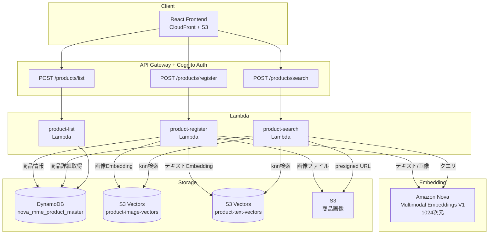

# 構成A: S3 Vectors + DynamoDB

## アーキテクチャ概要



```
[クエリ] → Nova Embeddings → S3 Vectors (knn) → DynamoDB (商品詳細) → レスポンス
```

- **ベクトルストア**: Amazon S3 Vectors
- **メタデータストア**: Amazon DynamoDB
- **Embedding モデル**: Amazon Nova Multimodal Embeddings V1 (1024次元)

## データモデル

### DynamoDB: `nova_mme_product_master`

| フィールド | 型 | 説明 |
|---|---|---|
| `product_id` (PK) | String (UUID) | 商品一意ID |
| `product_code` | String | 商品コード（例: A00001） |
| `product_name` | String | 商品名 |
| `category` | String | カテゴリ |
| `price` | Number | 価格 |
| `text_content` | String | 商品説明テキスト全文 |
| `image_s3_key` | String | 画像のS3キー |
| `created_at` | String (ISO8601) | 登録日時 |

**GSI:**
- `product_code-index` (PK: product_code)
- `category-index` (PK: category, SK: created_at)

### S3 Vectors インデックス

| インデックス名 | 次元 | 距離メトリック | 用途 |
|---|---|---|---|
| `product-image-vectors` | 1024 | cosine | 画像Embeddingの検索 |
| `product-text-vectors` | 1024 | cosine | テキストEmbeddingの検索 |

**ベクトルメタデータ:**
```json
{
  "product_code": "A00001",
  "product_name": "やわらかボストンバッグ",
  "category": "バッグ"
}
```

**キー**: `product_id` (DynamoDBのPKと同一)

## Embedding生成

| 処理 | taskType | embeddingPurpose | 入力 |
|---|---|---|---|
| 登録時 | SINGLE_EMBEDDING | GENERIC_INDEX | テキスト or 画像（別リクエスト） |
| 検索時 | SINGLE_EMBEDDING | GENERIC_RETRIEVAL | テキスト or 画像 |

**制約**: Nova Embeddingsはテキストと画像を同時に1リクエストで処理できない。別々にリクエストする。

## 検索クエリ設計

```python
s3vectors.query_vectors(
    vectorBucketName="nova-mme-vector-bucket",
    indexName="product-image-vectors",  # or "product-text-vectors"
    queryVector={"float32": query_embedding},
    topK=10,
    returnDistance=True,
    returnMetadata=True,
)
```

### 検索フロー

1. クエリ（テキスト or 画像）を Nova Embeddings でベクトル化（purpose: GENERIC_RETRIEVAL）
2. `product-image-vectors` と `product-text-vectors` の両インデックスに対して `query_vectors` 実行
3. 結果をマージ（同一商品が両方にヒットした場合、最小距離を採用）
4. 距離でソート（小さい = 類似度高い）
5. DynamoDB から商品詳細を取得、presigned URL を付与

### スコア

- **距離**: cosine distance (0.0 = 完全一致, 1.0 = 無関係)
- **類似度スコア（UI表示）**: `1 - distance`

## 評価ポイント

| 項目 | 評価 |
|---|---|
| セットアップ容易性 | ◎ S3 Vectorsはインデックス作成のみ、スキーマ設計不要 |
| コスト | ◎ 従量課金のみ、最低固定費なし |
| 検索方式 | △ ベクトル類似度検索のみ（全文検索なし） |
| 日本語対応 | △ Embeddingモデル依存（形態素解析なし） |
| スケーラビリティ | ○ S3ベースで自動スケール |
| レイテンシ | ○ 数百ms程度 |
| フィルタリング | △ メタデータフィルタのみ（テキスト部分一致不可） |
